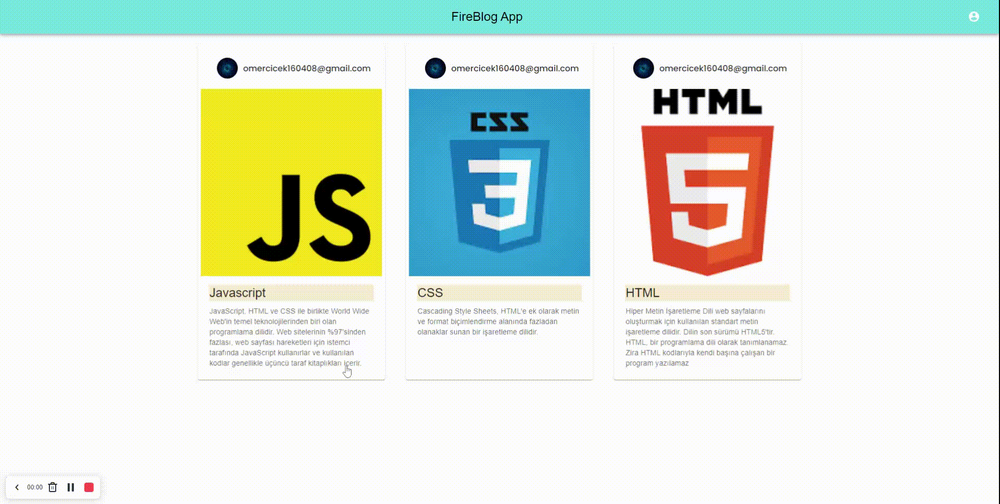

## Welcome! 👋

Thanks to visit my Github! This project is created with React, MUI, Firebase Authentication and Database, React-Router, Private Router. Here is the link for this project (https://omer-cicek.github.io/fireblog_app_context/)

**To do this project, i used React, MUI, Firebase Authentication and Database, React-Router, Private Router.**

# React Fireblog App

## Available Scripts

In the project directory, you can run:

### `npm install`
### `npm start`

## The challenge

Users should be able to:

- View the blogs that other users write
- See update and delete buttons if user owns the blog
- Sign in with Google
- See his own Google image and email address on his own blog

## Got feedback for me?

Feedbacks are always improve my technical knowledge, so feel free to give me a feedback through my LinkedIn account (https://www.linkedin.com/in/omercicek97/) 🙌

**This Is What I Did!** 🚀
